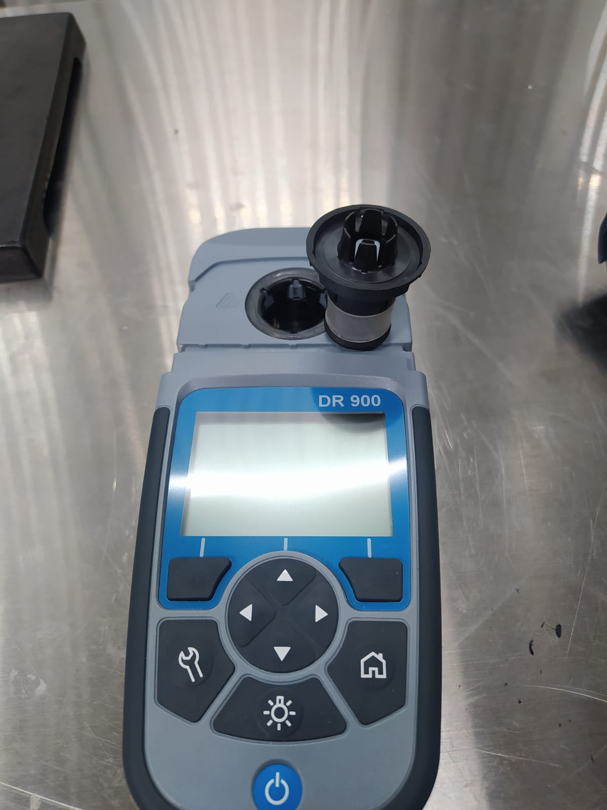
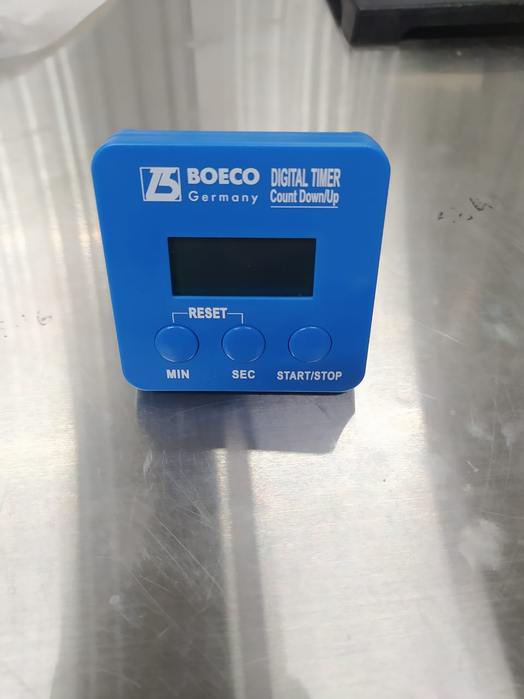
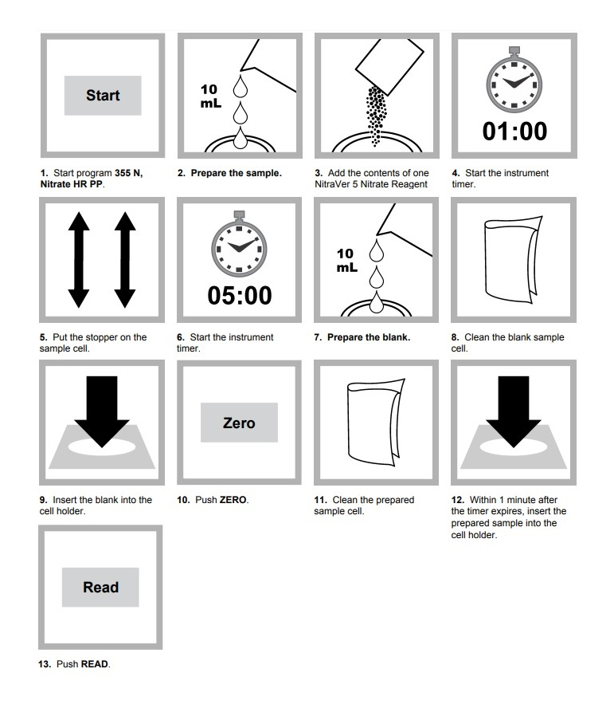

El siguiente protocolo tiene por finalidad establecer los pasos para medir la concentración de nitrato en los experimentos utilizando el Método de Reducción de Cadmio. El intervalo de concentración de lectura es de 0,3 a 30, 0 mg/L  N03-N (HR).

 **Instrumentos necesarios:**
 
 
 
 
 *-DR 900 adaptador
 *-DR 900 tapa
 *-Epp
 *-timer
 
  **Recogida y almacenamiento de muestras:** 
 * -Colecte las muestras y limpie los frascos de cristal o plástico
 * -Analice las muestras lo antes posible para obetener los mejores resultados. En caso de no ser posible, almacene la muestra a una temperatura menor a 6 C por un máximo de 48 h.
  * -Para preservar muestras para análisis posteriores por un máximo de 28 días, ajuste la muestra a pH menor a 2 con H2SO4(conc) alrededor de 2mL/L y almacene la muestra a temperaturas inferiores a los 6 C.
 * -Mantenga las muestras a preservar a una temperatura menor o igual a los 6 C(43 F) 
 * -Deje que la temperatura de la muestra aumente hasta la temperatura ambiente del local antes del análisis.
 * -Antes de analizar la muestra, ajustar el pH a 7 con 5,0 N de una solución estándar de NaOH.
 * -Corregir el resultado de la prueba por la disolución causada por la adición de volumen.

 **Procedimiento del ensayo:** 
  
 * -Seleccione el programa **355 N, Nitrate HR PP** 
 * -Prepare la muestra: Añada 10 mL de muestra a un tubo limpio
 * -Agregar 1 sachet de reactivo NitriVer 5 a cada muestra.
 * -Espere 1 min

 * -Prepare el blanco: Añada 0,1 mL de agua libre de amonio para un AmVer
 
 * -Añada el contenido del reactivo Na2S2O3, en polvo, para muestras de 5mL en cada vial
 * -Añada el contenido del reactivo CH4N2, en polvo, en cada vial
 * -Ponga las tapas en ambos viales. Agite bien para disolver el polvo
 * -Comience el conteo de la reacción: 20 min 
 * -Limpie el vial del blanco
 * -Inserte el vial del blanco dentro de la celda a 16 mm 
 * -Presione **ZERO**. La pantalla muestra 0,0 mg/L de NH3-N
 * -Limpie el vial de la muestra
* -Inserte el vial de la muestra dentro de la celda a 16 mm 
* -Presione **READ**. El resultado se muestra en la pantalla en mg/L de NH3-N

Para mayor información, consulte el Método 10031.
