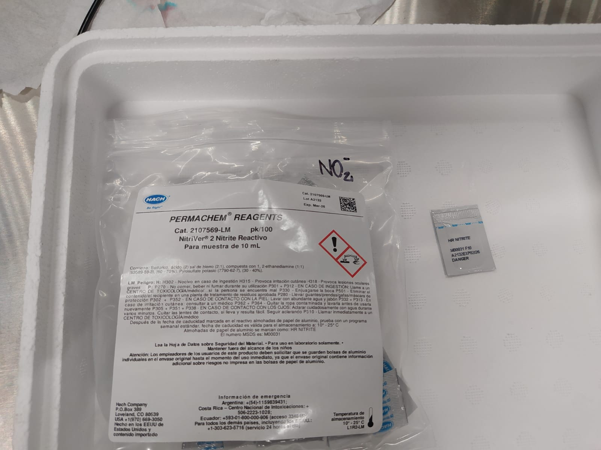
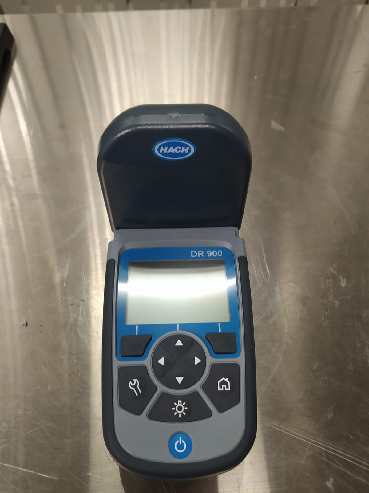

El siguiente protocolo describe los pasos a seguir para la cuentificación de Nitrito utilizando el Método de Sulfato Ferroso (Método 8153 de la empresa HACH).
El rango de concentración de lectura es de 2 a 150 mg/ L NO2 <exp>-</exp>  

 **Materiales necesarios para la medición:** 
- Agua desionizada
- Reactivo NitriVer 2 en polvo ( 1 sachet por cada muestra a medir)

- Celda de vidrio de 10 mL 
- Al menos, 20 mL de muestra
- Colorimetro 

**Recolección y almacenaje de muestras** 

- Tomar  las muestras en botellas plásticas o vidrio limpias 
- Para un análisis posterior, preservar las muestras a temperaturas menores a 6°C por más de 48 horas
- Si las muestras han estado guardadas, éstas deben incrementar su temperatura hasta la temperatura ambiente antes de la medición

---------------------------------------------------------------------------------------------------------------------------------------------
**Procedimiento** 
- Iniciar programa 373 N Nitrite HR PP 

- Preparar la muestra. Agregue 10 ml de muestra en una celda o tubo limpio.

- Agregar 1 sachet de reactivo NitriVer 2 a cada muestra.
 
- Cerrar la celda o tubo.Agitar hasta disolver.

- Esperar 10 minutos para que ocurra la reacción. Debe quedar sin moviemiento en una superficie plana.

- Preparar el blanco. Colocar 10 ml de muestra en celda de lectura.

- Limpiar celda con papel suave.

- Insertar celda en equipo.

- Precionar ZERO para configurar. Luego de la lectura el visor muestra 0 mg/L NO2 <exp>-</exp>  

- Quitar blanco.
- Invertir frasco con muestra y reactivo 2 veces antes de colocar muestra en celda.

- Limpiar celda con papel suave.

- Insertar celda en equipo

- Presionar READ para medir nitrato. Los resultados se mostraran el visor en mg/L NO2 <exp>-</exp> 
 
