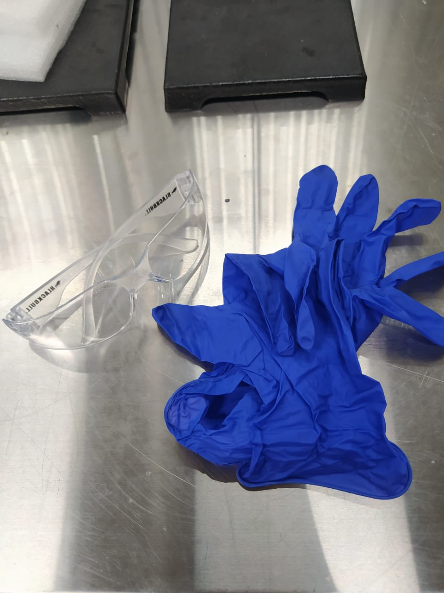

Protocolo para medir COD
========================

# Materiales necesarios
* Lentes de seguridad 
* Guantes de nitrilo
* Equipo DRB200 (Reacctor)
* Equipo DR900  (Colorímetro)

 <!-- .epp height="5%" width="5%" -->

