Protocolo para medir Demanda química del Oxígeno (COD) 
========================
_Usepa1 Reactor Digestion Method_

Ranges 3 to 150 mg/L COD and 20 to 1500 mg/L COD are USEPA approved for wastewater analyses (Standard Method 5220 D), Federal
Register, April 21, 1980, 45(78), 26811-26812.

# Materiales necesarios
* Lentes de seguridad 
* Guantes de nitrilo

* Equipo DRB200 (Reacctor) 
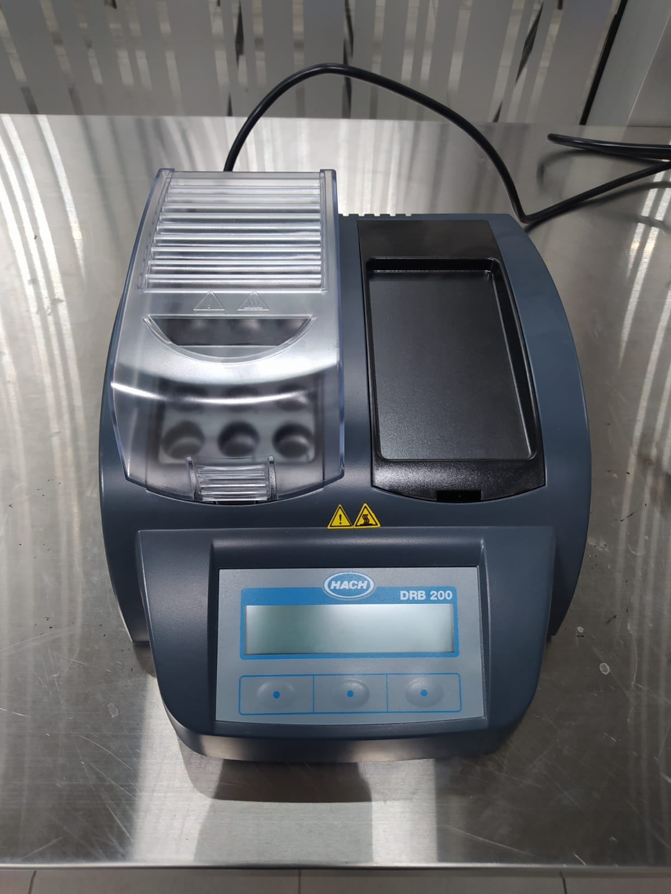
* Equipo DR900  (Colorímetro)   

* Viales de DQO 
 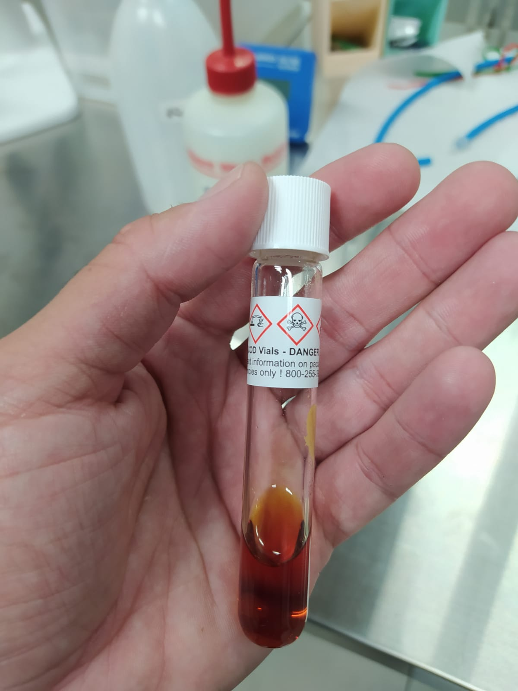
 * Pipetas
 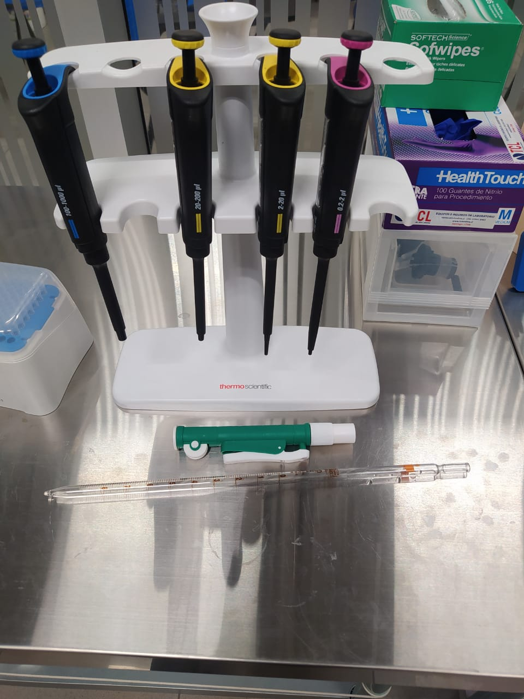

 # Metodología 
 
 Esta técnica nos permite medir los miligramos de O2 consumidos por litro de muestra tratada experimentalmente. La unidad de medida es mg/L. Este valor nos permite entender cuanta materia orgánica está siendo consumida por los organimos que forman la biopelícula, por tanto se puede deducir de ella el desempeño en terminos operacionales del bioreactor. La DQO se mide a una longitud de onda de 620 nm, para para colorímetros, funciona en 610 nm. 
 
 1. Prender el equipo DRB200 y precalentar a 150°C. 
  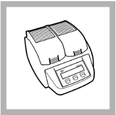
 2. Preparar la muestra : Abre la tapa del vial de DQO, y agrega 2 ml de muestra (2000 uL) con la pipeta P1000 al vial. 
  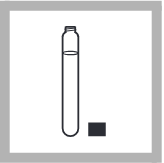 
 3. Cierra la tapa del vial y enguajalo superficialmente con agua destilada, luego sécalo con papel absorvente. El propósito es que el vial no quede manchado e interfiera en la léctura. 
  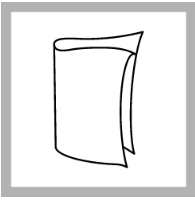 
 4. Agite o mezcle el víal cuidadosamente invirtiendolo varias veces 
  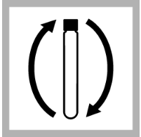 
 5. Ponga los viales en el reactos previamente calentado a 150°C ( paso 1) y déjelo incubar durante 2 horas ( 120 minutos)
   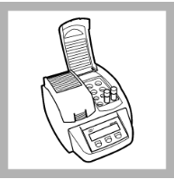 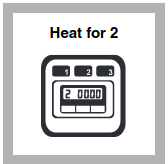
 6. Apague el reactor y deje enfriar los viales en el reactor por 20 minutos a 120°C o menos. 
 7. Luego agite los viales (igual al paso 4) y deje enfriar en un rack hasta que alcancen la tempereratura ambiente (ojalá en oscuridad)
 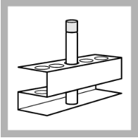
 8. Prenda el coloŕimetro y busque el programa "435 COD HR" y seleccionelo. 
  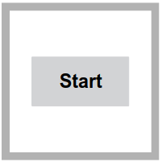
 9. Tome el vial que representa el BLANCO, limpie el vial y posicionelo en el lector del equipo DR900 (Con el adaptador para tubos de 16 mm). Cierre la tapa del equipo y marque " ZERO". Debe marcar 0. 
  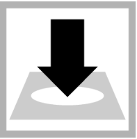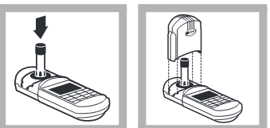
 10. Finalmente, tome su muestra, lipie el vial, posicionela en el equipo DR900  y lea el valor de la muestra. 
   
 
 11. Registre sus resultados en el libro de laboratorio, anotando el valor en mg/L y la fecha.
 
